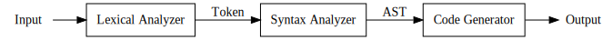
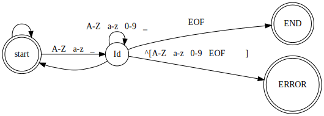
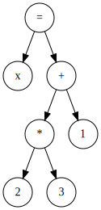
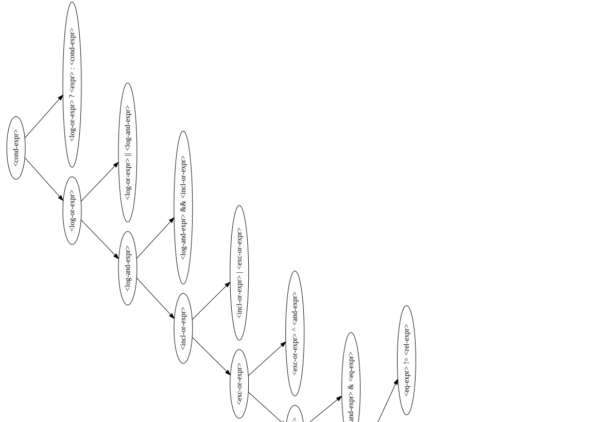
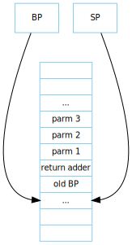

# README

這是我的畢業專題，是一個簡單的C語言編譯器，實作部份C99規範，其中大量參考[MazzCC](https://github.com/jserv/MazuCC)
由於時間及個人能力，有大量沒有實作的功能與bug，請見諒。
此README內容大量複製我當初的專題內容，由於當初趕工，可能會有格式、觀念的錯誤:p

# 目錄
* [使用方法](#使用方法)
* [文獻探討](#文獻探討)
   * [2.1 指令集架構](#21-指令集架構)
      * [2.1.1 Mano machine 簡介](#211-mano-machine-簡介)
         * [此計算機由下列硬體元件組成](#此計算機由下列硬體元件組成)
         * [指令集](#指令集)
         * [暫存器大小與功能](#暫存器大小與功能)
   * [2.2 編譯器理論](#22-編譯器理論)
      * [2.2.1 編譯器介紹](#221-編譯器介紹)
      * [2.2.2 編譯器原理](#222-編譯器原理)
         * [詞彙分析器](#詞彙分析器)
         * [語法分析器](#語法分析器)
         * [程式碼產生器](#程式碼產生器)
   * [2.3 組譯器](#23-組譯器)
   * [2.4 虛擬機器](#24-虛擬機器)
   * [2.5 C語言標準](#25-c語言標準)
   * [2.6 S-expression](#26-s-expression)
   * [2.7 Make](#27-make)
   * [2.8 BNF](#28-bnf)
* [3 問題探討](#3-問題探討)
   * [專案架構](#專案架構)
   * [3.1 GNU C preprocessor](#31-gnu-c-preprocessor)
   * [3.2 編譯器](#32-編譯器)
      * [3.2.1 前端](#321-前端)
         * [詞彙分析器](#詞彙分析器-1)
         * [語法分析器](#語法分析器-1)
      * [3.2.2 後端](#322-後端)
         * [Mano machine組合語言產生器](#mano-machine組合語言產生器)
         * [S-expression產生器](#s-expression產生器)
   * [3.3 組譯器](#33-組譯器)
      * [first pass](#first-pass)
      * [second pass](#second-pass)
   * [3.4 虛擬機器](#34-虛擬機器)
   * [3.5 系統前端](#35-系統前端)
* [結論與建議](#結論與建議)
   * [結論](#結論)
   * [參考資料](#參考資料)

# 使用方法

首先下載cc，這是一個編譯器控制界面，用來自動完成編譯、組譯、執行
並在cc資料夾內的source資料夾內放入asm、c0、sexp、vm四個專案
最後返回cc資料夾內，執行make指令，在bash（或其他類似的shell）中可這樣做

```bash
git clone https://github.com/hwei115j/cc.git
cd cc/source
git clone https://github.com/hwei115j/c0.git
git clone https://github.com/hwei115j/asm.git
git clone https://github.com/hwei115j/sexp.git
git clone https://github.com/hwei115j/vm.git
cd ..
make
```

之後就會出現一個執行檔cc，執行之後會出現    

```
cc [-s][-a][-S][-m][--dump-stack][--dump-memory] input.c
[-s]
    輸出組合語言檔案o.s

[-a]
    由stdout輸出格式化的S-expression

[-S][--dump-stack] %1
    輸出虛擬機的堆疊狀況。%1為一個小於4095的正整數，會列出4095~%1之間的記憶體位置

[-m][--dump-memory] %1 %2
    輸出虛擬機的記憶體位置。會列出%1 %2之間的記憶體範圍，在只有%1的情況下，會列出%1的記憶體位置

```

在cc資料夾內有兩個測試檔案，一個是in.c，用來測試基本功能，另外一個是nqueen.c，是一個八皇后程式（修改自MazuCC的測試），用來測試應用

使用
```bash
./cc in.c
```
會輸出

```
hello, world
5050

*
**
***
****
*****
******
*******
********
*********

1*1=1    2*1=2    3*1=3    4*1=4    5*1=5    6*1=6    7*1=7    8*1=8    9*1=9    
1*2=2    2*2=4    3*2=6    4*2=8    5*2=10   6*2=12   7*2=14   8*2=16   9*2=18   
1*3=3    2*3=6    3*3=9    4*3=12   5*3=15   6*3=18   7*3=21   8*3=24   9*3=27   
1*4=4    2*4=8    3*4=12   4*4=16   5*4=20   6*4=24   7*4=28   8*4=32   9*4=36   
1*5=5    2*5=10   3*5=15   4*5=20   5*5=25   6*5=30   7*5=35   8*5=40   9*5=45   
1*6=6    2*6=12   3*6=18   4*6=24   5*6=30   6*6=36   7*6=42   8*6=48   9*6=54   
1*7=7    2*7=14   3*7=21   4*7=28   5*7=35   6*7=42   7*7=49   8*7=56   9*7=63   
1*8=8    2*8=16   3*8=24   4*8=32   5*8=40   6*8=48   7*8=56   8*8=64   9*8=72   
1*9=9    2*9=18   3*9=27   4*9=36   5*9=45   6*9=54   7*9=63   8*9=72   9*9=81   

fib(23) = 28657

swap(10, 20) = (20, 10)

```
使用
```bash
./cc nqueen.c
```

會輸出這樣的形式
```

. . . . . Q . . 
. . Q . . . . . 
. . . . . . Q . 
. Q . . . . . . 
. . . Q . . . . 
. . . . . . . Q 
Q . . . . . . . 
. . . . Q . . . 

```

使用`./cc -s input.c`可以輸出組合語言，用`./cc -a input.c`可以輸出S表達式形式

# 文獻探討
本章節針對相關理論之文獻進行介紹，第一節介紹指令集架構、第二節介紹編譯器理論、第三節介紹C語言標準、第四節介紹組譯器、第五節介紹虛擬機器、第六節介紹S-expression、第七節介紹Make、第八節介紹BNF。

## 2.1 指令集架構
指令集架構(Instruction Set Architecture，縮寫為ISA)，又稱指令集或指令集體系，是電腦架構中與程式設計有關的部分，包含了基本資料類型，指令集，暫存器，尋址模式，儲存體系，中斷，異常處理以及外部I/O。指令集架構包含一系列的opcode即操作碼（機器語言），以及由特定處理器執行的基本命令。
而在此次實作中，我們選擇Mano machine做為目標ISA
### 2.1.1 Mano machine 簡介
Mano machine為一教學用計算機架構，擁有25條指令和4096x16bit位址空間，設計上與PDP8相似

#### 此計算機由下列硬體元件組成

>  4096個字的記憶體，其中每個字16位元
     9個暫存器: AR, PC, DR, AC, IR, TR, OUTR, INPR及SC
     7個正反器: I, S, E, R, IEN, FGI及FGO
    2個解碼器: 一個3x8運算解碼器及一個4x16定時解碼器
    一個16位元公用匯流排
    控制邏輯閘
    連接於AC之輸入的加法器和邏輯電路

#### 指令集

| 符號 |    十六進製碼    | 說明                    |
| :--: | :-------------: | :--------------------- |
|      |   `I=0   I=1`   | `記憶存取指令`          |
| AND  |  0xxx     8xxx  | 將記憶字與 AC 作 AND    |
| ADD  |  1xxx     9xxx  | 將記憶字加至 AC         |
| LDA  |  2xxx     Axxx  | 載入記憶字至 AC         |
| STA  |  3xxx     Bxxx  | 將 AC 內容儲存於記憶體中 |
| BUN  |  4xxx    Cxxx   | 無條件分支              |
| BSA  |  5xxx    Dxxx   | 分支並保存回返地址       |
| ISZ  |  6xxx    Exxx   | 遞增且若為零則跨越       |
|      | `暫存器存取指令` |                        |
| CLA  |      7800       | 清除 AC                 |
| CLE  |      7400       | 清除 E                  |
| CMA  |      7200       | 變補 AC                 |
| CME  |      7100       | 變補 E                  |
| CIR  |      7080       | 將 AC 與 E 向右循環     |
| CIL  |      7040       | 將 AC 與 E 向左循環     |
| INC  |      7020       | 遞增 AC                 |
| SPA  |      7010       | 若 AC 為正則跨越次一指令 |
| SNA  |      7008       | 若 AC 為負則跨越次一指令 |
| SZA  |      7004       | 若 AC 為零則跨越次一指令 |
| SZE  |      7002       | 若 E 為零則跨越次一指令  |
| HLT  |      7001       | 暫停計算機              |
|      | `輸入-輸出指令`  |                        |
| INP  |      F800       | 輸入字元至AC            |
| OUT  |      F400       | 從AC輸出字元            |
| SKI  |      F200       | 依輸入旗標跨越          |
| SKO  |      F100       | 依輸出旗標跨越          |
| ION  |      F080       | 啟動岔斷                |
| IOF  |      F040       | 停止岔斷                |
Mano machine指令集

#### 暫存器大小與功能

以下表格介紹Mano machine的暫存器與其功能

| 暫存器符號 | 位元數目 | 暫存器名稱 |      功能       |
| :-------: | :-----: | :-------: | :-------------: |
|    DR     |   16    | 資料暫存器 |  保存記憶體單元  |
|    AR     |   12    | 位址暫存器 |   保存記憶位址   |
|    AC     |   16    |   累積器   |   處理暫存器    |
|    IR     |   16    | 指令暫存器 |   保存指令碼    |
|    PC     |   12    | 程式計數器 | 保存指令碼之位址 |
|    TR     |   16    | 臨時暫存器 |  保存暫時性資料  |
|   INPR    |    8    | 輸入暫存器 |   保存輸入字元   |
|   OUTR    |    8    | 輸出暫存器 |   保存輸出字元   |


而Mano Machine的暫存器與記憶體連接方式如圖所示

## 2.2 編譯器理論
### 2.2.1 編譯器介紹
編譯器(compiler)是一種電腦程式，它會將某種程式語言寫成的原始碼(原始語言)轉換成另一種程式語言(目標語言)。
例如將C語言轉換成組合語言，或將java語言轉換為java位元組碼等，市面上常見的編譯器有GCC、ICC、LLVM等。
### 2.2.2 編譯器原理
一個基本的編譯器通常分為三個部份：詞彙分析器、語法分析器、程式碼產生器，詞彙分析器
詞彙分析器(Lexical Analyzer)，在此編譯器將會分析並且定義輸入的內容；
第二個部分為語法分析器(Syntax Analyzer)，在此編譯器將會分析各個元素的組成格式及結構；
第三個部分則是程式碼產生器(Code Generator)，在此編譯器會將符合使用者設定的輸入內容進行相對應的格式輸出
其流程圖如下所示



#### 詞彙分析器
將原始文字串流(Source code)，根據使用者自訂的規則，分為系統能辨識的有意義的區塊，稱為token，供下一階段的程式使用。
我們是根據C語言的規則去建立關鍵字。
每個token由name與type組成，name代表原始資料，而type代表他是屬於哪個類型的資料。
例如「int x = 1 + 2 * 3;」原始文字串流， 就會被分解成"int"、"x"、"="、"1"、"+"、"2"、"*"、"3"、";"等token，這些token的組成如下圖。

| name |    type     |
| :-- | :--------- |
| int  |     Int     |
|  x   |     Id      |
|  =   | TTYPE_PUNCT |
|  1   |     Num     |
|  +   | TTYPE_PUNCT |
|  2   |     Num     |
|  *   | TTYPE_PUNCT |
|  3   |     Num     |
|  ;   | TTYPE_PUNCT |

而詞彙分析器，本質上為一有限狀態自動機(finite-state machine，縮寫：FSM)，由多個狀態組成，根據輸入而轉移狀態，例如我們要解析Id這類型的token，那他的FSM如圖所示。

 詞彙分析器解析Id過程

#### 語法分析器
語法分析器主要的功能是根據使用者定義的語法規則，藉由詞彙分析器傳入的token，分析組成格式及結構，判斷token是否符合語法結構，而語法分析最後結果是生成容易被電腦解讀的AST(Abstract Syntax Tree 抽象語法樹)，供後續階段使用。
例如在function定義中，每個function在function name之後接的是左括號 `(`，如果function name之後不是左括號`(`，那就回傳錯誤，並給使用者錯誤訊息，如果解析正確，那便產生出AST，例如x = 1 + 2 * 3根據語法可以解析成以下的AST

AST示意圖

#### 程式碼產生器
程式碼產生器是編譯器的輸出部份，就如同前面的步驟，程式碼產生器會根據使用者定義的規則去解析AST，去產生目標程式碼。
而本次實作有兩個目標語言，一個是Mano machine組合語言，另一個是S-expression

例如圖所示AST可以被解析成以下S-expression

```lisp
(= ((int) x) 
    (+ 1 (* 2 3))))
```
## 2.3 組譯器
組譯器的功能是將組合語言轉換為等效二進制機械語言。
在Two-pass的架構，first pass建立symbol table，second pass則根據symbol table產生機械語言，symbol table是一種資料結構在組譯器中儲存標記的名稱以及所在的位址。
在組譯器中有一個被稱作位置計數器(location counter，簡稱LC)的變數，LC每處理一列碼之後便會遞增1，而如果遇到`ORG`虛擬指令時，便能夠設定LC的的值，在first pass中，組譯器會讀取組合語言文件，當遇到標記時，則紀錄標記和當時的LC到symbol table。

組譯器在second pass中藉由查表來翻譯組合語言，而此組譯器中一共有三張表
- symbol table
- 指令表
- 虛擬指令表

symbol table是在first pass中所建立的，指令表則儲存由Mano machine 提供的23個指令，虛擬指令則存`ORG`、`END`、`HEX`、`DEC`四個指令，其中`ORG`負責設定LC、`END`告訴組譯器組譯結束，`HEX`與`DEC`則為表示數值的進位

在second pass中，組譯器讀入一列原始程式，並解析指令，如果是一段指令，那就檢查參數是否正確，如果正確，那就根據上述三張表，翻譯為等效機器語言。
## 2.4 虛擬機器
虛擬機器是一個「虛假」的機器，我們為這個想像中的機器定義好機器語言，寫一個「特殊程式」來解讀並執行此機器語言，這個特殊程式就是「虛擬機器」。
最陽春的虛擬機器本質上就是「直譯器」。
本次實作上使用的機器語言為Mano machine機械語言，可以理解為Mano machine指令集的直譯器，此直譯器每次根據PC暫存器的值讀入資料，並且執行。

## 2.5 C語言標準
在1980年代，為了避免各家廠商實現的編譯器的C語法產生差異，美國國家標準協會(ANSI)，在1989年制定了一套標準，稱為ANSI C，也被稱作C89。
而這套標準後來被國際標準化組織(ISO)採用，制定了ISO/IEC 9899:1990，後來還有C99、C11等標準，本次實作主要參考C89與C99 標準。
## 2.6 S-expression
所謂「S-表達式/運算式」（S-expression）或「sexp」（其中「S」代表「符號的」），是指一種以人類可讀的文本形式表達半結構化數據的約定。
S-表達式以其在Lisp家族的程式語言中的使用而為人所知，使用前序表達式來表達AST，例如在S表達式中的`2 + 4  *  3  + 4`會成為`( + ( + 2 (* 4 3) ) 4)`
## 2.7 Make  

在軟體開發中，make是一個工具程式（Utility software），經由讀取叫做「makefile」的檔案，自動化建構軟體。
它是一種轉化檔案形式的工具，轉換的目標稱為「target」；與此同時，它也檢查檔案的依賴關係，如果需要的話，它會呼叫一些外部軟體來完成任務。它的依賴關係檢查系統非常簡單，主要根據依賴檔案的修改時間進行判斷。
大多數情況下，它被用來編譯原始碼，生成結果代碼，然後把結果代碼連接起來生成可執行檔或者庫檔案。
它使用叫做「makefile」的檔案來確定一個target檔案的依賴關係，然後把生成這個target的相關命令傳給shell去執行。

## 2.8 BNF
巴科斯範式(Backus Normal Form，縮寫為 BNF)，又稱為巴科斯-諾爾範式(Backus-Naur Form，縮寫同樣為 BNF)，是一種用於表示上下文無關文法的語言，上下文無關文法描述了一類形式語言。它是由約翰·巴科斯（John Backus）和彼得·諾爾（Peter Naur）首先引入的用來描述計算機語i言語法的符號集。

# 3 問題探討
本章節將根據前面所介紹文獻實作程式。實作過程大量參考成功大學jserv的MazuCC，除了引用AST格式外還使用此專案的list資料結構，並且在程式實作上參考MazuCC的實作

## 專案架構
本專案由多個組件構成，每個組件由Make分別管理，最後將其放置於系統前端的`source`資料夾中，由系統前端的make遞迴的呼叫每個組件的make完成編譯

+ 系統總共分為幾個部份
    + GNU C preprocessor
    +  編譯器
    +  組譯器
    +  虛擬機器
    +  sexp S表達式格式化工具
    + 系統前端

之間的關係如圖

編譯器的架構如下
組譯器的架構如下
虛擬機器的架構如下
sexp的架構如下
系統前端的架構如下

## 3.1 GNU C preprocessor
C語言標準規定，預處理是指前4個編譯階段（phases of translation）。
1. 三字符組與雙字符組的替換。
2. 行拼接（Line splicing）: 把物理源碼行（Physical source line）中的換行符轉義字符處理為普通的換行符，從而把源程序處理為邏輯行的順序集合。
3. 單詞化（Tokenization）: 處理每行的空白、注釋等，使每行成為token的順序集。
4. 擴展巨集與預處理指令（directive）處理。

由於能力與時間的關係，前置處理採用直接呼叫現成的GNU C preprocessor(簡稱cpp)，用來展開集處理巨集，例如#define、#include、#if....#endif等GNU C preprocessor皆可處理
以下為cpp的使用說明
> `cpp
>                       [-Dmacro[=defn]...] [-Umacro]
>                       [-Idir...] [-iquotedir...]
>                       [-M|-MM] [-MG] [-MF filename]
>                       [-MP] [-MQ target...]
>                       [-MT target...]
>                       infile [[-o] outfile]`
>
>  Only the most useful options are given above; see below for a more complete list of preprocessor-specific options.  In addition, cpp accepts most gcc driver options, which are not listed here.  Refer to the GCC documentation for details.

## 3.2 編譯器
編譯器分為前端與後端，前端分為詞彙分析器與語法分析器，後端分為組合語言產生器與S表達式產生器。
### 3.2.1 前端
編譯器前端會將原始程式碼，轉換成相等形式的AST格式，供後續階段使用，分為詞彙分析器與語法分析器兩階段。
####  詞彙分析器
詞彙分析器根據使用者定義的規則，將輸入文字串流轉換為token，每個token分為name與type兩個欄位。
主要實作於lex.c，開放出以下的函式供後續程式使用。

```c
int is_punct(token *tok, int c); /*判斷tok是否是punct且符合c*/
void unget_token(token *tok);    /*將tok還回去*/
token *peek_token(void);         /*預先得知下個token，但不讀入*/
token *read_token(void);         /*讀入下個token*/
```

token 的結構定義放在c0.h中。

```c
typedef struct {
    int type;
    union {
        char *sval;
        int  punct;
        int ch;
    };
}token;
```
token的type使用enum定義為

```c
enum {
   Unkonwn = 256,
   TTYPE_PUNCT,
   Num, End, Id, Str,
   Addsub, Muldiv, Assign, Lparen, Rparen, Dq, Comma, Slash, Bslash, Lbraces, Rbraces, Semicolon,
   If, Int, Char, While, Ret
};
```

前面章節提到過，詞彙分析器本質上為有限狀態自動機，而在判斷狀態轉移的地方使用了GNU C 擴充，例如在switch中使用以下語法便能選取範圍，而這是在標準C中無法做到的。

```c
    /*
     * case Low ... high: 的語法是GCC的擴展語法，並非標準C，使用時請多加注意
     * https://gcc.gnu.org/onlinedocs/gcc-7.4.0/gcc/Case-Ranges.html
     */
    switch(ch) {
        case '0' ... '9':
            ungetc(ch, stdin);
            return read_num('+');
        case 'A' ... 'Z':
        case 'a' ... 'z':
        .
        .
        .
    }
```

而在程式中大量使用static技巧，將只這個.c檔案內使用的函式的命名空間限制在這個.c檔內，建立內部函式，防止其他檔案存取。

#### 語法分析器
語法分析器使用使用者定義的語法去分析token，我們作為參考的語法為整理自*The C Programming Language. 2nd Edition*附錄的BNF語法，雖然當時C89尚未發布，但其所使用草案與C89幾乎相同，所以可視為C89標準之BNF。
語法分析器實作於parser.c檔案中，在實作上，採用了LL的遞迴下降分析法，根據語法規則去逐個展開語法，直到達到終端節點為止，並同時生成AST

例如下列BNF形式語法

```bnf
<conditional-expression> ::= <logical-or-expression>
                           | <logical-or-expression> ? <expression> : <conditional-expression>

<logical-or-expression> ::= <logical-and-expression>
                          | <logical-or-expression> || <logical-and-expression>

<logical-and-expression> ::= <inclusive-or-expression>
                           | <logical-and-expression> && <inclusive-or-expression>

<inclusive-or-expression> ::= <exclusive-or-expression>
                            | <inclusive-or-expression> | <exclusive-or-expression>

<exclusive-or-expression> ::= <and-expression>
                            | <exclusive-or-expression> ^ <and-expression>

<and-expression> ::= <equality-expression>
                   | <and-expression> & <equality-expression>

<equality-expression> ::= <relational-expression>
                        | <equality-expression> == <relational-expression>
                        | <equality-expression> != <relational-expression>
```

將其以圖的形式展示如下，部份命名採用縮寫

在程式上的實作則為

```c
static Ast *conditional_expr()
{
    Ast *ast = logical_or_expr();
    token *tok = read_token();

    if(is_punct(tok, '?')) {
        Ast *r = expr();
        token *rtok = read_token();
        if(!is_punct(rtok, ':'))
            error("next is ':' ");
        Ast *l = conditional_expr();
        r = ast_binop(rtok->punct, r, l);

        return ast_binop(tok->punct, ast, r);
    }
    unget_token(tok);

    return ast;
}


static Ast *logical_or_expr()
{
    Ast *ast = logical_and_expr();
    token *tok = read_token();

    while(is_punct(tok, PUNCT_LOGOR)) {
        ast = ast_binop(tok->punct, ast, logical_and_expr());
        tok = read_token();
    }
    unget_token(tok);
    return ast;
}

static Ast *logical_and_expr()
{
    Ast *ast = inclusive_or_expr();
    token *tok = read_token();

    while(is_punct(tok, PUNCT_LOGAND)) {
        ast = ast_binop(tok->punct, ast, inclusive_or_expr());
        tok = read_token();
    }

    unget_token(tok);
    return ast;
}

static Ast *inclusive_or_expr()
{
    Ast *ast = exclusive_or_expr();
    token *tok = read_token();

    while(is_punct(tok, '|')) {
        ast = ast_binop(tok->punct, ast, exclusive_or_expr());
        tok = read_token();
    }

    unget_token(tok);
    return ast;
}

static Ast *exclusive_or_expr()
{
    Ast *ast = and_expr();
    token *tok = read_token();

    while(is_punct(tok, '^')) {
        ast = ast_binop(tok->punct, ast, and_expr());
        tok = read_token();
    }

    unget_token(tok);
    return ast;
}

static Ast *and_expr()
{
    Ast *ast = equality_expr();
    token *tok = read_token();

    while(is_punct(tok, '&')) {
        ast = ast_binop(tok->punct, ast, equality_expr());
        tok = read_token();
    }

    unget_token(tok);
    return ast;
}

static Ast *equality_expr()
{
    Ast *ast = relational_expr();
    token *tok = read_token();

    while(is_punct(tok, PUNCT_EQ) || is_punct(tok, PUNCT_NE)) {
        ast = ast_binop(tok->punct, ast, relational_expr());
        tok = read_token();
    }

    unget_token(tok);
    return ast;
}
```

不難看出，其中存在歸約關係，例如`logical_or_expr || logical_and_expr`可以將其中的`logical_or_expr`展開為`logical_or_expr`或是`logical_or_expr || logical_and_expr`會成為`logical_or_expr || logical_and_expr || logical_and_expr`以正規表示法表示為`{logical_or_expr || }+ logical_and_expr` 其他關係式也可類推，當中有大量呼叫自身的遞迴，由於是尾遞迴的狀況，所以可以直接改寫為迴圈。

而由於遞迴的限制，在某些情況下直接根據語法無法產生合適的AST，還需要上下文的幫助，例如

```c
int a[2] = {1, 2};
.
.
.
a + 2;
```

此時後面表達式的`a + 2`，a的型態為「int [2]」，而2的型態為「int」，兩者的型態並不一致，此時就需要轉型，而這是如果不知道前面定義的a的型態是無法知道的，所以我們在這裡引入symbol table，用來紀錄之前定義過的型態，在之後需要用到的時候可以得知此時的上下文狀態，而轉型的具體規則參考C89規格書。

此編譯器支援不完整的陣列與指標，根據語法規則，可以總結出圖n解析過程，首先從name及含有name的括號開始解析，再來是name的左邊、name的右邊。

例如
`int *(*a)[]`，便能解析成`a->*->[]->*->int`，即為`declare a as pointer to array of pointer to int`
`int (*foo[])(int, int)`，便能解析成`foo->[]->*->（function) (int, int)->(return) int`，即為`declare foo as array of pointer to function (int, int) returning int`
更為複雜的宣告也依同樣規則解析。

而在表達式中，所有的陣列皆轉換成指標形式，例如a的型態為`int [10]`，那在表達式中的`a[2]`便會轉換成`*(a + 2)`，此時的`+2`，並不是整數的`2`，而是兩單位的偏移，這個單位的大小為「a所指向型態的大小」，例如a指向的型態為`int`，在編譯器中`int`的大小為1 word，也就是1。
### 3.2.2 後端
編譯器後端主要根據編譯器前端產生的AST來生成目標程式碼，本次實作共有兩個目標語言，分別是Mano machine的組合語言以及S-expression。
####  Mano machine組合語言產生器
使用遞迴去翻譯AST，並且選擇合適的組合語言，並用symbol table儲存上下文，例如變數的記憶體位置等，但由於目標語言過於簡陋，在很多功能上實作較為困難

例如在函式呼叫方面，直覺的想法可能是先取得函式的開始位址，然後直接jmp過去，但此基本計算機唯一能取得記憶體位址的方法只有跳轉到副程式的`bsa`指令，而且只能取得跳轉前的位址，所以不能簡單的取得記憶體位置，只能採取比較迂迴的作法。

如圖所示，首先用呼叫副程式的方法呼叫`main`，在`main`開頭有存放返回位址的空間，然後呼叫`.GETF`副程式，`.GETF`副程式會將跳轉前的記憶體位址存在AC並加一(也就是`BUN main`的下一行)，此時main再返回，存在AC內的值便是函式實際開頭的記憶體位址，再呼叫`.CALL`副程式，便能跳轉到main函式內了，其他有需要取得絕對記憶體位置的功能皆採用此作法。

```
                BUN    main
                BSA    .CALL
                .
                .
                .
main,           DEC     0
                BSA     .GETF
                BUN     main            I
                .
                .
                .
                BSA     .RET
```

而ISA提供的呼叫副程式`BSA`指令與C語言定義的函式還是有很大的差別，例如無法在副程式中呼叫自己，一旦呼叫，原先的資料就會被覆蓋掉，造成程式錯誤，而要使用類似C的函式，則需要引入堆疊(stack)，利用先進後出(FILO)的特性，來儲存返回位址與區域變數，而堆疊所需要的 `PUSH`與`POP`指令則由副程式實作。

```c
    emit(".PUSH,  DEC 0");       //將AC .PUSH到mem[.SP--]
    emit("        STA .SP I");
    emit("        LDA .SP");
    emit("        ADD .N1");
    emit("        STA .SP");
    emit("        BUN .PUSH I");

    emit(".POP,   DEC 0");       //將mem[++.SP]讀到AC
    emit("        LDA .SP");
    emit("        INC");
    emit("        STA .SP");
    emit("        LDA .SP I");
    emit("        BUN .POP I");
```

而提到C的函式，那就不得不提呼叫約定，呼叫約定定義了
-  極微參數或複雜參數獨立部分的分配順序
- 參數是如何被傳遞的（放置在堆疊上，或是暫存器中，亦或兩者混合）
- 被呼叫者應儲存呼叫者的哪個暫存器
- 呼叫函式時如何為任務準備堆疊，以及任務完成如何恢復

而我們參考cdecl在x86上的內容，經過修改和簡化後得到以下的呼叫約定
1. 函式參數按照從右至左的順序依次壓棧
2. 函式結果儲存在暫存器AC中
3. 呼叫者負責從堆疊中彈出參數
4. 堆疊上先後順序為：參數、返回位址、old BP

函式呼叫時的動作如下
1. 將參數右至左的PUSH進堆疊
2. 將PC PUSH進堆疊
3. 將BP PUSH進堆疊
4. BP = SP

呼叫後的記憶體位置如下圖


而函式返回時的動作如下
1. 將返回值放入AC
2. SP = BP
3. POP並將值存入BP
4. 再次POP並用POP值返回原函式
5. 呼叫者清除傳入參數

最後生成的組合語言，為了方便管理，所以分成許多段，有儲存指令的.text段，儲存全域變數的.bss段和儲存區域變數的.stack段，其記憶體分配如圖所示


#### S-expression產生器
前端語法分析器產生的AST是一種資料結構，需要一個方便呈現的形式，以便除錯，而我們從LISP語言的呈現方式得到靈感，使用與LISP相同的S-expression作為AST的輸出，可以以前序表示法的形式輸出AST。

例如圖n的C語言原始程式，經過前端的處理之後生成的AST，可以轉換成圖m的S-expression格式輸出。

```c
int main()
{
    int a;
    if(a)
        a = 0;
}
```

```Lisp
(AST_FUNC (main (int))
          (AST_DECL (= ((int) a)))
          (AST_IF (COND ((int) a))
                  (THEN (= ((int) a) 0))
                  (ELSE)))
```

而由S表達式產生的AST並無排版功能，所有的輸出為同一行，為了方便閱讀，所以另外寫了一個小程式，稱為sexp，用來做S表達式的排版，方便閱讀，排版規則如圖

>大寫開頭的字母為Key_word，排版規則為Key_word後第一個element不換行，第二個以後換行，並且對齊第一個element左括號
>運算式不換行（+ - * / & |....)
>element：(...)、123、abc、ABC、+、-.........
>
## 3.3 組譯器
組譯器的功能是將組合語言轉換為機械語言，由於組合語言與機械語言幾乎是一對一的關係，實作上較為單純，本次實作採用two-pass的架構，因為此架構需要讀取輸入兩次因而得名。
一個two-pass的組譯器需要讀取原始組合語言兩次，分別為first pass和second pass，其中first pass負責建立symbol table，second pass根據symbol table生成機械語言。
而組譯器通常會為了開發方便提供虛擬指令供使用者使用，此組譯器提供的虛擬指令為`ORG`、`END`、`HEX`、`DEC`四個指令，其中`ORG`負責設定LC、`END`告訴組譯器組譯結束，`HEX`與`DEC`則為表示數值的進位。

### first pass
考慮圖n組合語言程式，數字的部份表示LC的值，其他部份表示組合語言，組合語言表示，把`memory[996]`讀入`AC暫存器`，並遞增，再將其存入`memory[996]`，可以將其轉換成圖m機械語言，其中996為十進制，需將其轉換為十六進制的0x3E4。

```
0        LDA    996
1        INC
2        STA    996
3
.
.
.
996      DEC    0
```

` 23E4    7020    33E4 `

但這樣簡易的形式，在組合語言更為複雜的情況下便會出現問題，例如在LC為1的INC後插入一個INC，如圖n。

```
0        LDA    996
1        INC
2        INC
4        STA    996
5
.
.
.
997      DEC    0
```

這樣就會發生錯誤，所以需要加上一個不會變動的標記，讓程式碼不會因為微小的改動而發生錯誤，如圖m。

```
0        LDA    a
1        INC
2        STA    a
3
.
.
.
996 a,   DEC    0
```

這裡a是一個標記，這個標記會在組譯時期，被轉換為具體的記憶體位置，而在程式選寫的時候，設計師並不需要去考慮他在哪個位址上，firse pass時掃描原始程式碼，如果遇到標記，那就將其紀錄到symbol table上。
### second pass
組譯器會在second pass中藉由查表來翻譯組合語言，而此組譯器中一共有三張表
- symbol table
- 指令表
- 虛擬指令表

在second pass階段中，如果標記欄不為空，那就跳過，為空則解析指令欄的指令，如果為虛擬指令`ORG`則設定LC的值，為`END`則結束組譯，再來根據指令表來解析指令，指令的格式最多為三個單詞，最少為一個，解析後則翻譯成對應的二進制值，如果指令中有遇到標記，那就查找symbol table來確定具體的LC值。

## 3.4 虛擬機器

>   4096個字的記憶體，其中每個字16位元
     9個暫存器: AR, PC, DR, AC, IR, TR, OUTR, INPR及SC
     7個正反器: I, S, E, R, IEN, FGI及FGO
     2個解碼器: 一個3x8運算解碼器及一個4x16定時解碼器
     一個16位元公用匯流排
     控制邏輯閘
     連接於AC之輸入的加法器和邏輯電路

使用變數模擬正反器與暫存器，並定義各種指令，如下

```c
uint16_t dr_reg;    //資料暫存器 16bit
uint16_t ir_reg;    //指令暫存器 16bit
uint16_t ac_reg;    //累加器     16bit
uint16_t tr_reg;    //臨時暫存器 16bit
uint16_t pc_reg;    //程式計數器 12bit
uint16_t ar_reg;    //位置暫存器 12bit
uint8_t  inpr_reg;  //輸入暫存器  8bit
uint8_t  outr_reg;  //輸出暫存器  8bit
bool     i_ff;      //I正反器1 間接 0直接
bool     s_ff;      //S正反器1 啟動 0關閉
bool     e_ff;      //E正反器1 進位 0沒進位
bool     r_ff;
bool     ien_ff;
bool     fgi_ff;
bool     fgo_ff;

enum Code {
    AND, ADD, LDA, STA, BUN, BSA, ISZ,
    CLA = 0x7800,
    CLE = 0x7400,
    CMA = 0x7200,
    CME = 0x7100,
    CIR = 0x7080,
    CIL = 0x7040,
    INC = 0x7020,
    SPA = 0x7010,
    SNA = 0x7008,
    SZA = 0x7004,
    SZE = 0x7002,
    HLT = 0x7001,
    INP = 0xF800,
    OUT = 0xF400,
    SKI = 0xF200,
    SKO = 0xF100,
    ION = 0xF080,
    IOF = 0xF040,
};
```

## 3.5 系統前端

這四個組件之間由系統前端cc來統一管理，根據參數的不同，能夠編譯C原始檔並執行，輸出組合語言或是AST，在沒有參數時會顯示出使用說明 

由main的int argc、char *argv[]參數接收由Shell傳入的參數，argc傳遞總共有幾個參數，argv用來傳遞參數的具體值，例如：`./cc -s input.c`中，argc為`3`、argv[1]為`-s`，傳入參數後再做進一步的解析，當沒有參數或參數錯誤便會顯示以下使用說明

>cc [-s][-a][-S][-m][--dump-stack][--dump-memory] input.c
[-s]
    輸出組合語言檔案o.s
>
>[-a]
    由stdout輸出格式化的S-expression
>
>[-S][--dump-stack] %1
    輸出虛擬機的堆疊狀況。%1為一個小於4095的正整數，會列出4095~%1之間的記憶體位置
>
>[-m][--dump-memory] %1 %2
    輸出虛擬機的記憶體位置。會列出%1 %2之間的記憶體範圍，在只有%1的情況下，會列出%1的記憶體位置

cc [-s][-a][-S][-m][--dump-stack][--dump-memory] input.c
[-s]
    輸出組合語言檔案o.s

[-a]
    由stdout輸出格式化的S-expression

[-S][--dump-stack] %1
    輸出虛擬機的堆疊狀況。%1為一個小於4095的正整數，會列出4095~%1之間的記憶體位置

[-m][--dump-memory] %1 %2
    輸出虛擬機的記憶體位置。會列出%1 %2之間的記憶體範圍，在只有%1的情況下，會列出%1的記憶體位置

# 結論與建議
## 結論
我們專題的目的是藉由一個基本計算機、組譯器、編譯器，來對編譯、組譯、載入、執行等動作有更深入的理解，而此次實作確實有完成目標，但多少有些遺憾之處，例如編譯器實作C語言並不完全符合標準，功能尚有不足，選擇的ISA過於簡單與理想，缺乏實用性，假如能實作類似x86這種主流ISA實用性會更加好。
而除了對完整流程的了解更加深入外，此次實作的軟體的程式碼行數為我們至今為止寫過規模最大的專案，除了對設計程式更加熟悉外，也學習到了更多管理專案的技巧。
## 參考資料
[1] 林登(Lindan, P.V.D.)著(2008)。C專家編程(Expert C Programming: Deep C Secrets)(徐波 譯)。北京：人民郵電出版(原作1994出版)

[2] Brian W. Kernighan & Dennis M. Ritchie著(民77)。C程式語言:第二版(The C Programming Language 2nd.)(冼鏡光 譯)。台北市:儒林圖書。(原作1988出版)

[3] M. Morris Mano 著(民83)。計算機系統結構(呂紹偉、吳淑錦 譯)。台北市:東華。(原作1993出版)

[4] 陳鍾誠(2017)。系統程式。台北市:旗標

[5] 俞甲子、石凡、潘愛民(2009)。程式設計師的自我修養 -- 連結、載入、程式庫。台北市:碁峰資訊

[6] Jim Huang(2019)。A minimalist C compiler with x86_64 code generation。檢自https://github.com/jserv/MazuCC

[7] pandolia(2019)。自己動手寫編譯器。檢自https://pandolia.net/tinyc/index.html

[8] Ira Baxter(2016)。Questions about Abstract Syntax Tree (AST)。檢自https://stackoverflow.com/questions/40527580/questions-about-abstract-syntax-tree-ast

[9] The syntax of C in Backus-Naur Form。檢自https://cs.wmich.edu/~gupta/teaching/cs4850/sumII06/The%20syntax%20of%20C%20in%20Backus-Naur%20form.htm
